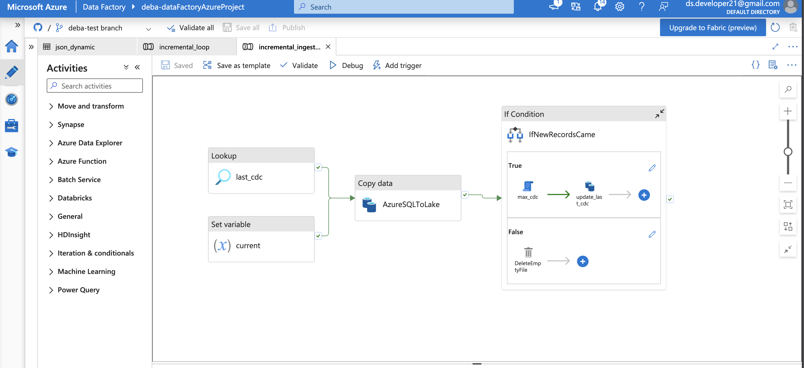
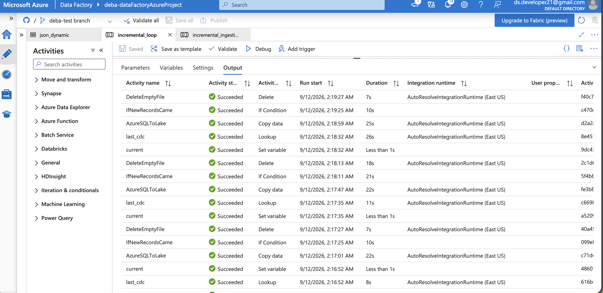

# 🎵 Spotify Data Engineering Project | End-to-End Azure Data Pipeline


> **From raw data to meaningful insights — building a modern, scalable data engineering pipeline on Microsoft Azure.** 🚀

## 📌 Project Overview

This project demonstrates the design and implementation of an end-to-end data engineering pipeline using **Microsoft Azure** and **Azure Databricks**, inspired by a Spotify data engineering tutorial.

The objective is to build a cloud-based data platform that can ingest, store, process, and transform data into meaningful datasets for analytics and reporting.

Throughout this project, I explored real-world data engineering concepts such as cloud data ingestion, data lake architecture, distributed data processing, ETL workflows, and data transformation using Apache Spark.

This repository documents my learning journey, implementation, Azure resources, pipeline design, and project results.

---

## 🎯 Project Objectives

* Build an end-to-end data engineering pipeline using Microsoft Azure.
* Understand how Azure Data Factory orchestrates data movement and workflows.
* Store data efficiently using Azure Data Lake Storage Gen2.
* Process and transform data using Azure Databricks and PySpark.
* Understand the Medallion Architecture: Bronze, Silver, and Gold.
* Explore Delta Lake and scalable data processing.
* Learn how cloud services work together in a modern data platform.
* Document and manage the project using GitHub.

---

## 🏗️ Project Architecture

The project follows a cloud-based data engineering workflow in which data is ingested, stored, processed, and prepared for analytical use.

```text
                  ┌──────────────────────┐
                  │     Data Source      │
                  │  Spotify / Source    │
                  │       Data           │
                  └──────────┬───────────┘
                             │
                             ▼
                  ┌──────────────────────┐
                  │  Azure Data Factory  │
                  │   Data Ingestion &   │
                  │   Pipeline Control   │
                  └──────────┬───────────┘
                             │
                             ▼
                  ┌──────────────────────┐
                  │    ADLS Gen2         │
                  │   Data Lake Storage  │
                  └──────────┬───────────┘
                             │
                             ▼
                  ┌──────────────────────┐
                  │  Azure Databricks   │
                  │  PySpark Processing │
                  │  Data Transformation│
                  └──────────┬───────────┘
                             │
                             ▼
                  ┌──────────────────────┐
                  │   Delta Lake Tables  │
                  │ Bronze | Silver |    │
                  │ Gold (where used)    │
                  └──────────┬───────────┘
                             │
                             ▼
                  ┌──────────────────────┐
                  │  Analytics &         │
                  │  Reporting Layer     │
                  └──────────────────────┘
```

> **Note:** Update the source and destination stages to match the exact implementation in your project.

---

## 🔄 Data Pipeline Workflow

### 1. Data Ingestion

Azure Data Factory is used to orchestrate the data ingestion process.

The pipeline is responsible for moving data from the source system into the Azure data lake.

### 2. Data Storage

Azure Data Lake Storage Gen2 provides scalable cloud storage for the ingested data.

The data lake acts as the central storage layer for the data engineering workflow.

### 3. Data Processing

Azure Databricks is used to process and transform the data using Apache Spark and PySpark.

This stage can include:

* Data cleaning.
* Handling missing values.
* Data type conversion.
* Deduplication.
* Data transformation.
* Business logic implementation.

### 4. Data Transformation and Modeling

The processed data can be organized using the Medallion Architecture:

| Layer     | Description                              |
| --------- | ---------------------------------------- |
| 🥉 Bronze | Raw or minimally processed data          |
| 🥈 Silver | Cleaned and transformed data             |
| 🥇 Gold   | Curated data for analytics and reporting |

### 5. Analytics

The final datasets can be consumed by reporting or analytics tools to generate meaningful insights.

---

## 🖼️ Azure Data Factory Pipeline

The following screenshot shows the Azure Data Factory pipeline created as part of this project.

> **📷 Add your pipeline screenshot here.**



*Azure Data Factory pipeline design and workflow orchestration.*

---

## ✅ Successful Pipeline Execution

The screenshot below demonstrates the successful execution of the Azure Data Factory pipeline.

> **📷 Add your successful pipeline execution screenshot here.**



*Successful pipeline execution in Azure Data Factory.*

---

## 🛠️ Technology Stack

| Technology                   | Purpose                                   |
| ---------------------------- | ----------------------------------------- |
| Microsoft Azure              | Cloud platform                            |
| Azure Data Factory           | Data ingestion and orchestration          |
| Azure Data Lake Storage Gen2 | Cloud data lake storage                   |
| Azure Databricks             | Data processing and transformation        |
| Apache Spark                 | Distributed data processing               |
| PySpark                      | Data transformation using Python          |
| Delta Lake                   | Reliable data storage and processing      |
| Unity Catalog                | Data governance and access management     |
| GitHub                       | Version control and project documentation |

*Include only the services that you actually used in your implementation.*

---

## ⚙️ Getting Started

### Prerequisites

Before running this project, make sure you have access to:

* An active Microsoft Azure subscription.
* An Azure Data Factory resource.
* An Azure Data Lake Storage Gen2 account.
* An Azure Databricks workspace.
* Appropriate permissions for storage and catalog access.
* Basic knowledge of SQL, Python, and PySpark.

### Setup Instructions

1. Clone this repository.

2. Open the project in your preferred development environment.

3. Configure the required Azure resources.

4. Set up ADLS Gen2 storage and the required access permissions.

5. Configure Azure Data Factory linked services and datasets.

6. Import or create the Databricks notebooks.

7. Configure the required data paths, catalogs, schemas, and credentials.

8. Run the pipeline and validate the processed data.

> **Security Note:** Never commit Azure access keys, passwords, client secrets, tokens, or other sensitive credentials to GitHub. Use Azure Key Vault, managed identities, or securely configured secrets instead.

---

## 📊 Project Highlights

✨ Designed a cloud-based data engineering workflow.

✨ Worked with Azure Data Factory for pipeline orchestration.

✨ Explored Azure Data Lake Storage Gen2 for scalable storage.

✨ Used Azure Databricks and PySpark for data transformation.

✨ Learned about layered data architecture and Delta Lake.

✨ Practiced cloud resource configuration, permissions, and data access.

✨ Documented the project and maintained its source code using GitHub.

---

## 🧠 Key Learning Outcomes

This project helped me strengthen my understanding of:

* End-to-end ETL and ELT workflows.
* Azure Data Factory pipeline development.
* Azure Databricks notebooks and Spark processing.
* Data lake architecture.
* Incremental data processing concepts.
* Data transformation and data quality.
* Cloud identity and access management.
* Version control and project documentation.

---

## 🚀 Future Enhancements

* Add automated CI/CD deployment for Databricks notebooks and pipelines.
* Improve data quality checks and validation.
* Add monitoring and alerting for failed pipeline runs.
* Integrate Power BI for interactive reporting.
* Optimize Spark jobs and data storage.
* Implement more robust incremental loading and data governance.

---

## 👨‍💻 Author

**Debaditya Singh**
 
Data Engineer | Azure | Databricks | PySpark | SQL

---

⭐ If you find this project useful, feel free to star the repository and explore the implementation!
